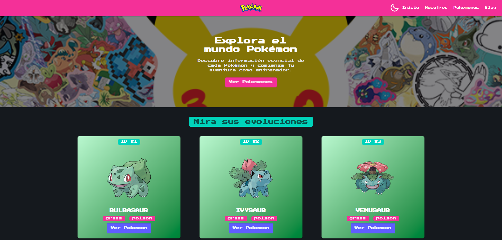
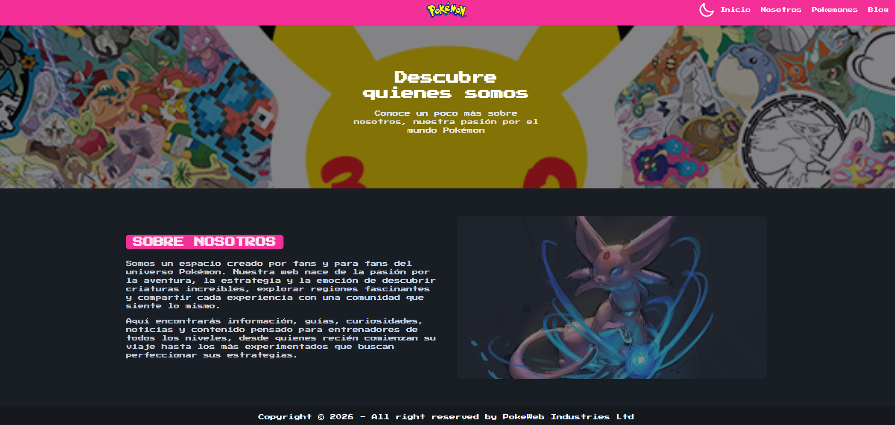
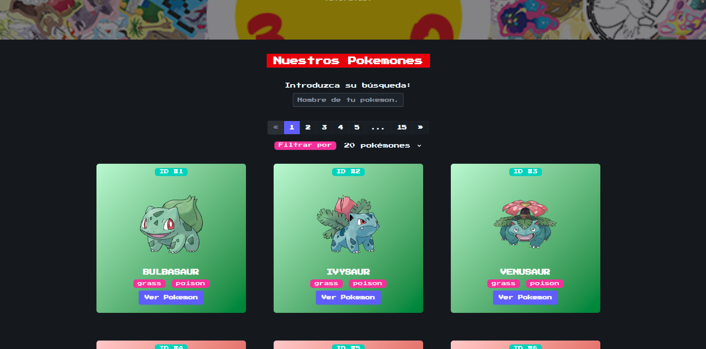
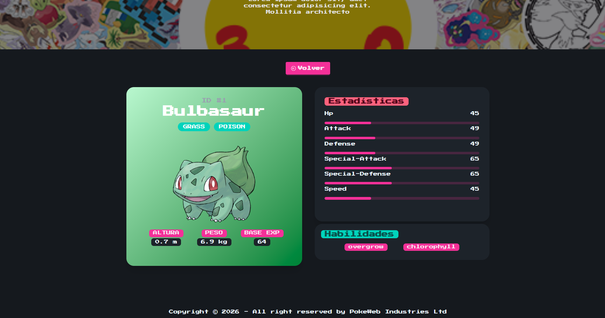
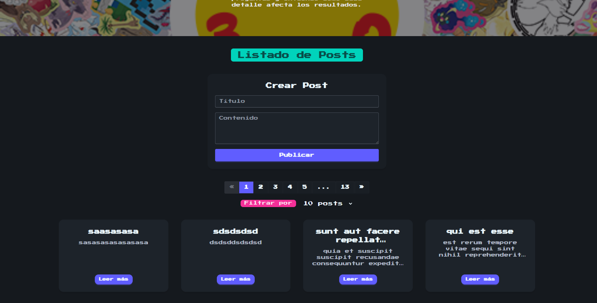
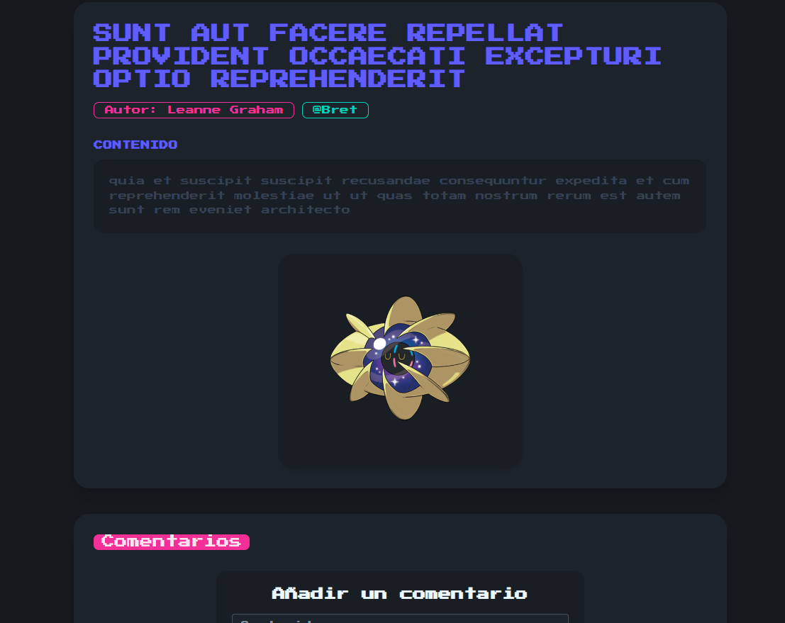
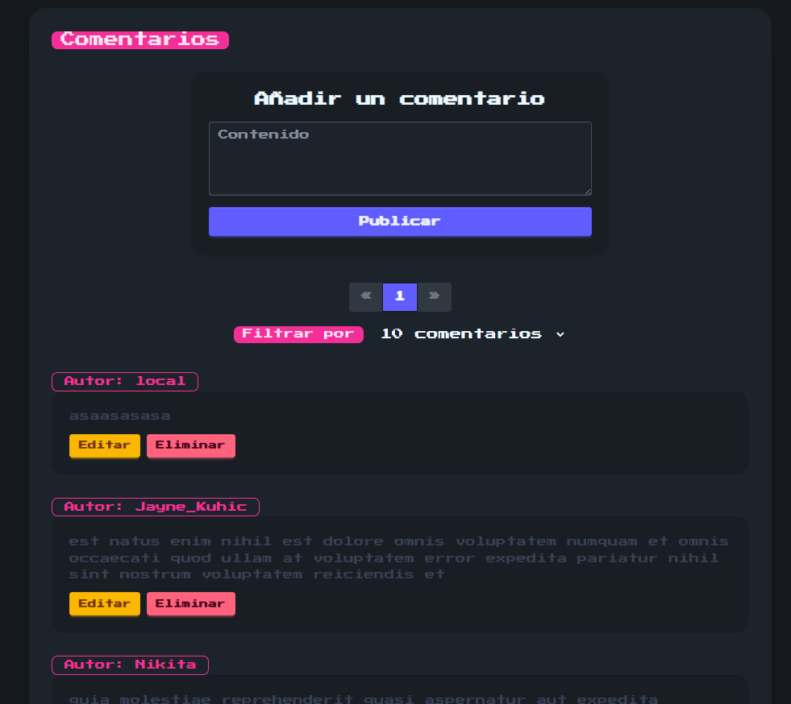
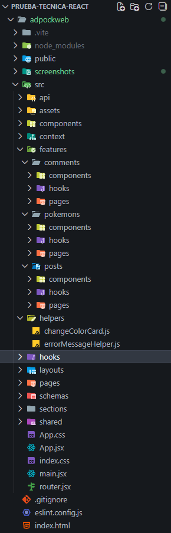

# Prueba-Tecnica-React

Aplicación desarrollada con React que permite visualizar Pokémon, gestionar comentarios y manejar estado de forma eficiente utilizando React Query, apoyándose de Api's como PokeApi y JsonPlaceHolder.


---

## Teconologías Utilizadas 🚀

   

  

  


---

## Preview

### Inicio


### Sobre Nosotros


### Pokemons


### Detalle del pokemon


### Blog


### Detalle del post


### Comentarios del post


---

## ⚙️ Instalación


---

### 1️⃣ Clonar el repositorio

```bash
git clone https://github.com/Firework18/Prueba-Tecnica-React.git
cd tu-repo
```

### 2️⃣ Instalar dependencias

```bash
npm install
```

### 3️⃣ Ejecutar el proyecto

```bash
npm run dev
```

---

> [!WARNING]  
> Asegúrate de tener Node.js 18 o superior instalado.
> 
> Puedes verificarlo con:
> 
> ```bash
> node -v
> ```

---
## Funcionalidades

### Gestión de Pokémon
- Listado de Pokémon con paginación dinámica según la cantidad solicitada en la petición.
- Filtro de búsqueda por nombre.
- Vista de detalle individual de cada Pokémon.
- Navegación entre páginas.

---

### Sección de Blog
- Visualización de posts obtenidos desde la API pública de JSONPlaceholder.
- Creación de posts simulados almacenados en LocalStorage.
- Vista de detalle de cada post.
- Visualización de comentarios asociados al post.

---

### Gestión de Comentarios
- Crear comentarios.
- Editar comentarios existentes.
- Eliminar comentarios.
- Actualización optimista para mejorar la experiencia de usuario.

---

### Experiencia de Usuario
- Modo oscuro / modo claro.
- Notificaciones con Toastify.
- Validación de formularios con Zod + React Hook Form.

> [!NOTE]  
> La creación/edición/eliminación de POSTS y COMMENTS no afectará a la data real traída por la Api de JsonPlaceHolder.
> La información agregada solo se almacenará en el LocalStorage del navegador

---
## Arquitectura
El proyecto sigue una arquitectura modular basada en features, donde cada dominio de la aplicación está aislado y organizado de forma independiente.



## Uso de Features

La aplicación está organizada siguiendo un enfoque modular por *features*.  
En lugar de agrupar archivos únicamente por tipo (componentes, hooks o servicios), cada dominio de la aplicación —como Pokémon o Blog— contiene su propia lógica y estructura interna.

Dentro de cada feature se encuentran:

- Componentes específicos  
- Hooks personalizados  
- Llamadas a API  
- Queries y mutaciones relacionadas  

Este enfoque permite mantener el proyecto ordenado y preparado para crecer.  
Además, reduce el acoplamiento entre módulos y facilita el mantenimiento a largo plazo.

---

## Manejo de Estado

El manejo de datos asíncronos se realiza mediante React Query, lo que permite gestionar estados de carga, errores y caché de forma eficiente.

Se implementa actualización optimista en determinadas mutaciones para mejorar la experiencia de usuario, reflejando cambios en la interfaz antes de que el servidor confirme la operación.

La lógica de obtención y manipulación de datos se mantiene desacoplada de los componentes visuales, promoviendo una arquitectura más limpia y reutilizable.

---

## Validación y Formularios

Los formularios se gestionan con React Hook Form, lo que ayuda a agilizar y simplificar el control del estado al no realizar renders innecesarios.

Las validaciones se definen mediante Zod, centralizando los esquemas en la carpeta `schemas` para facilitar su reutilización y mantener una estructura clara dentro del proyecto.

---
